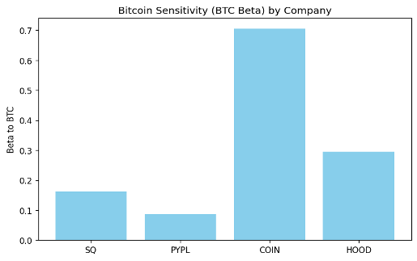
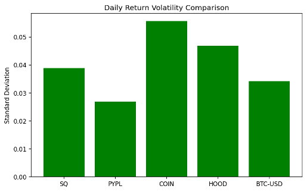
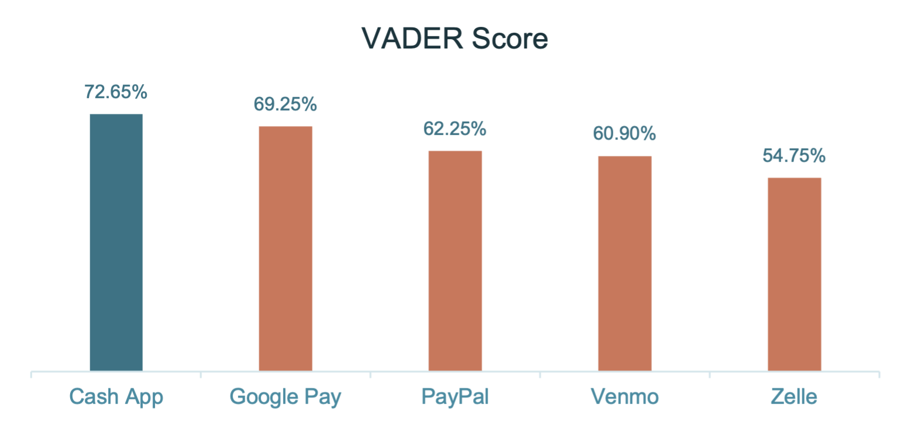

# Block, Inc. (SQ) - Analytics for Finance | Competitive, Risk, and Sentiment Analysis

## Overview  
This project analyzes **Block, Inc. (NYSE: SQ)** as a hybrid fintech company operating across merchant payments, consumer finance, and Bitcoin-focused infrastructure. We combine **market-based analytics (returns, volatility, beta)** with **product and strategy analysis**, and complement it with **consumer sentiment analysis** of Cash App and competing payment apps using Google Play reviews (2023 to 2025).

🔗 [Live Streamlit App](https://competitive-and-risk-analysisfintech-ad2swxqfaimz9m9zcdukac.streamlit.app/)

---

## Problem Statement  
1. Where does Block sit on the spectrum between traditional fintech and crypto-native firms?
2. How sensitive is Block to Bitcoin price movements (Bitcoin beta) and how does its volatility compare to peers?  
3. Do Cash App user reviews indicate a competitive advantage in product experience and trust?  
4. How do regulation and consumer protection shape Block’s strategic direction and risk profile?

---

## Block and Its Products  

| Platform / Business | What it does | Why it matters strategically |
|---|---|---|
| **Square (Seller ecosystem)** | POS + payment processing + vertical SaaS (payroll, marketing, inventory) + Square Banking | Anchors stable GPV-driven cash flows and builds merchant switching costs |
| **Cash App (Consumer super-app)** | P2P, banking-lite, Cash Card + Boosts, investing, Bitcoin trading, tax filing | Drives engagement and monetization across interchange, instant deposit fees, and trading spreads |
| **Afterpay (BNPL)** | Pay-in-4 and merchant-integrated BNPL | Links consumer demand to merchant network and expands credit products |
| **TIDAL (Creator tools)** | Music streaming + creator monetization | Supports Block’s broader “economic empowerment” narrative |
| **Spiral + TBD (Bitcoin infra)** | Open-source Bitcoin tools, Lightning development, decentralized identity and payments protocols | Positions Block as a builder of long-term Bitcoin rails, not just a trading app |
| **Bitcoin hardware and mining** | ASIC chips, mining rigs, self-custody wallet efforts | Creates optionality: hardware revenue, mining pool fees, and lower execution costs for Cash App BTC trades |

---

## Competitive Analysis  

### Business model comparison  
| Company | Core model | Primary customer | Role of crypto in strategy |
|---|---|---|---|
| **Block (SQ)** | Seller payments + consumer finance + Bitcoin infra | SMBs + underbanked/Gen Z consumers | **Central pillar** (BTC trading + infra + mining initiatives) |
| **PayPal (PYPL)** | Global payments network | Merchants + mainstream consumers | Minimal (buy/sell only) |
| **Coinbase (COIN)** | Crypto exchange | Retail traders + institutions | Core business (high cycle sensitivity) |
| **Robinhood (HOOD)** | Retail brokerage | Young retail investors | Material, but mixed with equities/options cycles |

### Bitcoin beta (sensitivity) summary  
Bitcoin beta measures how much a stock’s returns move with Bitcoin returns (higher = more BTC-like behavior).

| Company | Estimated Bitcoin Beta (range) | Interpretation |
|---|---:|---|
| **COIN** | ~0.6 to 0.8 | Strongly linked to BTC cycles |
| **HOOD** | ~0.25 to 0.30 | Moderate exposure via retail crypto activity |
| **SQ** | ~0.15 to 0.20 | Meaningful BTC linkage, partially insulated by non-BTC revenue |
| **PYPL** | ~0.0 | Mostly independent of BTC cycles |

### Volatility positioning  
| Asset | Relative volatility level | What it implies |
|---|---|---|
| **COIN** | Highest | Most sensitive to crypto market shocks |
| **HOOD** | High | Retail trading cycle exposure |
| **SQ** | Moderate | Hybrid fintech-crypto behavior |
| **BTC** | Moderate-high | Crypto asset cyclicality |
| **PYPL** | Lowest | Mature payments platform stability |

---

## Cash App Sentiment Analysis (Google Play Reviews, 2023 to 2025)  
We used a VADER-based NLP pipeline to measure sentiment from app reviews and compare Cash App against Google Pay, PayPal, Venmo, and Zelle.

**Average VADER sentiment by app**  

### Summary table
| App | Avg VADER (compound) | Positive % | Neutral % | Negative % |
|---|---:|---:|---:|---:|
| **Cash App** | ~0.37 | **72.65%** | ~14% | ~13% |
| **Google Pay** | ~0.27 | **69.25%** | ~15% | ~15% |
| **PayPal** | ~0.23 | **62.25%** | ~17% | ~21% |
| **Venmo** | ~0.22 | **60.90%** | ~14% | ~25% |
| **Zelle** | ~0.19 | **54.75%** | ~21% | ~24% |

**Interpretation:** Cash App leads on average sentiment and has the largest positive-review share, consistent with its product breadth (P2P + banking-lite + rewards + investing + Bitcoin).

---

## Regulation, Consumer Protection, and Bitcoin Strategy  

### 2025 compliance and penalty overview  
| Category | Amount (USD) | What it reflects |
|---|---:|---|
| Consumer refunds | $120M | Unresolved transaction alerts and consumer protection gaps |
| State regulators (AML) | $80M | Weak AML controls and risk rating issues |
| New York DFS | $40M | Broader crypto oversight failures |
| **Total** | **$255M** | Compliance investment became unavoidable at scale |

### Consumer protection transformation  
Block’s response focused on trust-building actions that can become a competitive differentiator:
- Scam reimbursement program (broad coverage)  
- AI-powered fraud detection and real-time transaction monitoring  
- Stronger identity verification and enhanced Bitcoin due diligence  
- Independent oversight (monitoring and audits)

### Bitcoin-first positioning  
Block follows a **Bitcoin-only** approach, aiming to build a regulated, trust-focused crypto access layer. The bet creates:
- Upside: vertical integration, reduced execution costs, differentiated infra  
- Risk: regulatory uncertainty, multi-chain market evolution, compliance burden

---

## Key Takeaways  
- Block sits between fintech and crypto-native peers with moderate BTC sensitivity and moderate volatility.  
- Diversification (Square + Cash App) partially insulates Block from pure crypto cycles.  
- Cash App shows the strongest consumer sentiment, supporting a product-led advantage.  
- Regulatory pressure is now a strategic variable: compliance and consumer protection can differentiate Block if the industry tightens.  
- Bitcoin mining and infrastructure are a long-term optionality play, not just a trading feature.

